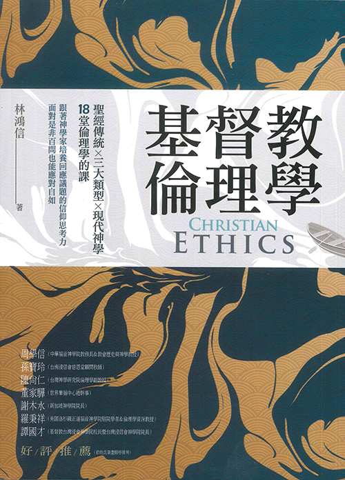
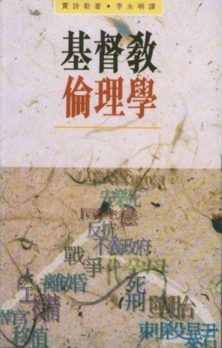
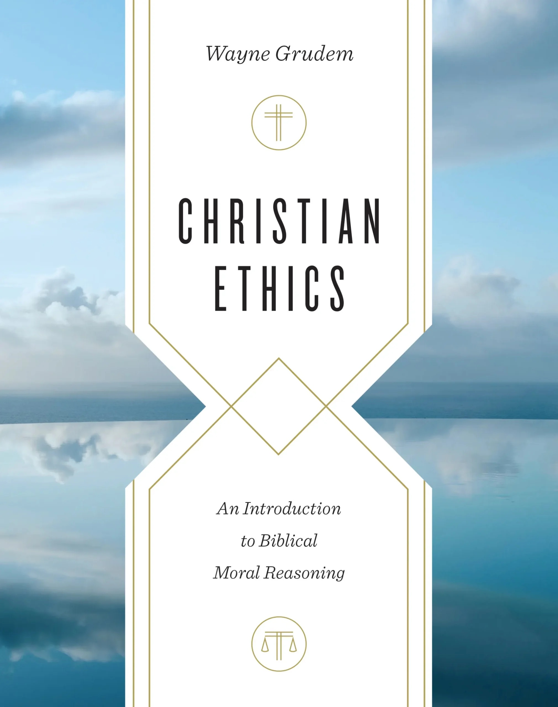
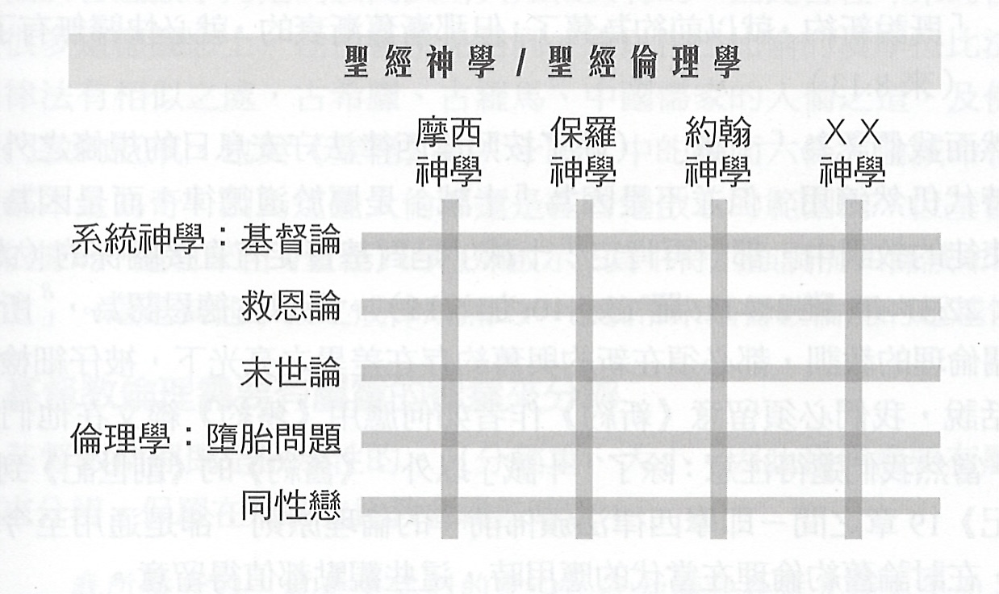
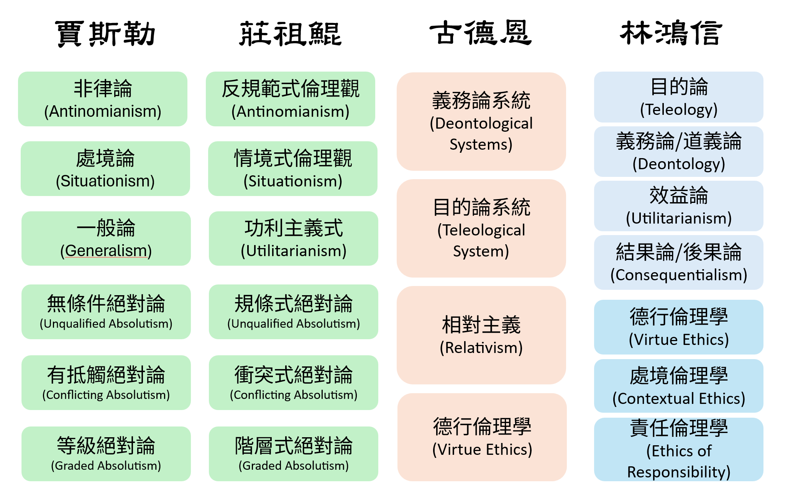

# 基督教倫理學

## Unit 01 - 導論

---
# 課程介紹
- 課程目標
- 課程結構與方式
- 課程用書
- 課程評分

---
# 基督教倫理學定義
- 賈斯勒、莊祖鯤、(孔祥炯)
- 古德恩
- 羅秉祥、孔祥炯
- 林鴻信

---

第一部  緒論
- 導論／如何做倫理道德判斷？

第二部  聖經
- 聖經倫理學

第三部  傳統
- 奧古斯丁倫理學／路德倫理學／加爾文倫理學／重洗派倫理學／衛斯理倫理學／天主教倫理學

第四部  類型
- 德行倫理學／務實倫理學／責任倫理學

第五部  現代
- 潘霍華倫理學／路易斯倫理學／從巴特到莫特曼／生命倫理

---

> 倫理學是研究有關行爲規範 (norm，準則) 的學門，基督教倫理學則探討建立在基督教信仰價値觀的行爲規範……
> 
> 基督教倫理學是以上帝旨意作爲倫理道德思考、判斷的中心，追求分辨什麼是上帝的心意，而上帝心意的對立面往往就是邪惡，因此基督教倫理學也同時追求辨識邪惡。
> 
> 基督教倫理學的思考主要根據來自以聖經爲主、傳統爲輔，參照知、情、意 (理性、感性、行動) 三方面整合而成， 因此與系統神學沒有本質上的區別。

\- 林鴻信 (52-53)

---

> 聖經所呈現的上帝卻是又公正又慈愛，上帝的公正是慈愛的，而上帝的慈愛是公正的。當一味強調公正，往往失之刻薄；而單單強調慈愛常又是非不分。追求公正中有慈愛、慈愛中有公正，這不只是根據上帝性情做神學反思，而且是倫理道德判斷的重要規範。人信什麼樣的上帝就做什麼樣的倫理道德判斷；反之，**人做什麼樣的倫理道德判斷，就反映信什麼樣的上帝。** 

\- 林鴻信(61)

---

## 羅秉祥

> 基督敎倫理學，或稱道德神學，顧名思義，是一門與人類的道德或倫理生活有關的學問。

> 倫理或道德，是一種價値，是一種與人的品行、操守及人格有關的價値，是人類生活中與是非、對錯、善惡及好壞有關的價値。

> 基督敎倫理學 (或道德神學) 是：站在基督敎信仰的立場，對基督徒及一般人的倫理道德生活，
> 有系統的反省、分析及評價的學科。

---

## 賈斯勒

> 倫理學乃是研究道德上的對與錯

強權是正確 / 習俗便是倫理

人是量度的標準 / 人類是對錯的基礎

「正確」是中庸

「正確」是那些帶來快樂的事物

「正確」是為最多人帶來最大的善

「正確」是那些在本質上值得渴想的事物 

「正確」是無從定義的

**「善」是神的旨意**

---

## 古德恩

> Christian ethics is any study that answers the question, "What does the whole Bible teach us about which acts, attitudes, and personal character traits receive God's approval, and which do not?" 

> 基督教倫理學是任何針對這個問題作出回答的研究：「整本聖經教導我們哪些行為、態度和個人品格特質是蒙神喜悅的，哪些則不是？」

> The emphasis of systematic theology is on what God wants us to believe and to know, while the emphasis in Christian ethics is on what God wants us to do and what attitudes he wants us to have. . . . Thus theology focuses on ideas while ethics focuses on situations in life. Theology tells us how we should think while ethics tells us how we should live.

> 系統神學強調的是上帝要我們相信和知道什麼，而基督教倫理學則強調上帝要我們去做什麼，以及要我們擁有什麼樣的態度。……因此，神學聚焦於思想，而倫理學則聚焦於生活情境。神學告訴我們應該如何思考，而倫理學則告訴我們應該如何生活。

---

## 莊祖鯤

- 從西方字源學來看倫理
	- 「倫理」希臘文 *ethos*，「道德」拉丁文 *mores*，是習慣或習俗
	- 約定俗成的生活規範
- 從中國哲學來看倫理
	- 「倫」=「人」+「侖」(與車輪相關)
	- 圍繞著「君臣、父子、兄弟、夫妻、朋友」的五倫為主軸來討論
- 從社會運作來看倫理
	- 討論人類在社會中如何作出種種對與錯的抉擇。
	- 這些抉擇攸關社會的生存、發展，也影響到社會中的人際關係。
	- 這種倫理抉擇是是相對性的，而非絕對的。
- 從基督教的角度來着倫理
	- 強調人與神的關係之優先性。
	- 天倫之道決定人倫之道。

---

## 孔祥炯

1. 倫理學 (Ethics) 是研究道德原則的學科，目標是分辨正確和錯誤的行為。
	- 倫理學一詞來自兩個希臘詞：「習慣」(ethika) 和「品格」
	- 它的內容關乎「生活的態度和品行」。  
2. 倫理學的分門：若單單考慮其用途，則可分為兩個門類
	- 理論倫理學 (或普通倫理學 / theoretical  or general ethics)，研究**原則和概念**。
	- 實用倫理學 (或特殊倫理學 / applied or special ethics)，研究**如何應用原則**去分析道德問題。 
3. 倫理學的目的：瞭解如何作出道德上正確的決定。
	- 最簡單和直接的方式是根據道德「規範」(norms，或稱「道德準則」或「道德律」) 付諸行動。例如：謀殺是錯的、  誠實是對的。

---

## 課間活動

請花一些時間思考以下問題。

- 你怎麼定義基督教倫理學?
- 這樣的定義怎麼幫助你做倫理議題議斷?
- 有沒有明顯的困難?

David: 
- 基督教伦理学定义：按照神在圣经中所启示的，基督耶稣教导门徒所要遵守的原则，在实际生活中活出来。
Franky: 
- 如何實踐「行公義、好憐憫、愛神愛人」的聖經原則。
Fiona: 
- 基督教伦理学是基督徒如何在生活中活出信仰的样式。在我们的生活中当碰到问题和冲突时，圣经有哪些观点和经文讲述过相关的伦理问题。这些圣经真理又在当今的时代教会社会中，如何运用和解决的。
Sherry:
- 过去的我，认为是基督教对于道德准则的定义。但是今天学习后，开阔了眼界，我个人认为是以神的标准来思考人的伦理，是在生活实践中的如何活出神的标准。
Grace:
- 按上帝的屬性和在【聖經】中的道德律的教導作為對日常生活中的發生的各種事情及處理人際關係做出對錯的判斷並作出合神心意的選擇及行為。
Ping:
- 基督教伦理学是一门探讨人在日常生活中如何按照基督信仰来行事为人的学科。他不仅研究“什么是对的”更关注为什么是对的和如何按神的旨意行义。是以圣经启示为最高权威，指导信徒在各样处境中做出合乎神旨意的道德判断与行为选择。基督教伦理学不仅告诉我们该怎么想，更教导我们该怎么活。

---
# 基督教倫理學與其它學科

- 基督教倫理學與系統神學
	- 德國傳統：屬於系統神學的一部份
		- 優點：論及倫理議題時仍然具有神學的整體觀點，
		- 缺點：容易過度偏重教義，而忽略知與行、理想與現實之間的差距。
	- 美國傳統：獨立於系統神學之外
		- 優點：尊重專業而有更多元的對話，重視認清議題的事實眞相；
		- 缺點：受到過多專業硏究的影響， 連帶地造成基督教信仰價値觀移動，甚至可能偏離神學研究的本意

---

- 基督教倫理學與聖經神學
	- 聖經神學及聖經倫理學是以**作者**為主體，是在特定的歷史和時空環境下。系統神學和倫理學則是依據**主題**來歸納，因此是跨時代、辯證式 (dialectic) 的。
	- 聖經神學的研究方法是以**歷史和文法**為主，系統神學及倫理學則是以**邏輯**為主要的工具，歸納出綜合性的結論。
	- 正如聖經神學與系統神學兩者是相輔相成的，可以編織成「真理之網」。同理，基督教倫理學與聖經倫理學也有類似的相互關係。

---

---
# 倫理學系統

