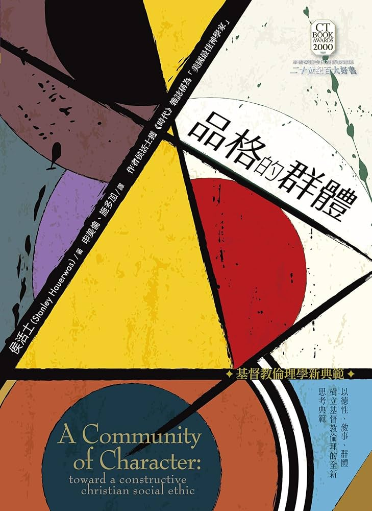

## 非律論/ 反規範式 Antinomianism 

賈氏：非律倫的基本信念
- 否定道德律的神性
- 否定道德律的客觀性
- 否定道德律的永恆性
- 並非反對規律

莊氏：最極端的相對主義式倫理觀
- 否定一切的道德律
- 沒有客觀的道德準則，一切都是以人為中心
- 沒有公認規範可尋；只要我喜歡，為 什麼不可以？
- 後現代，越來越多的人採取這種反傳統、無規範、極端個人主義的倫理觀

---
## 處境論 / 情境式 Situationism

賈氏：以傅勒徹爾理論為主
- 處境論是介乎律法主義 (Legalism) 和非律論之間。
- 並非無論，而是只有一條律法——愛。
- 愛心若要否決真理，便由它罷；爲愛而作的事，都是好的。
- 愛在律法之上。

Rae, Scott B. _Moral Choices: An Introduction to Ethics_. 4th ed. Grand Rapids: Zondervan, 2018. 

---
### 處境論的優缺點

優點：
- 它是有規範的立場
- 它是一個絕對論  
- 解決法則抵觸的問題  
- 了解不同處境的價値  
- 注重愛和人的價値  

缺點：
- 一條法則太籠統  
- 處境不能界定愛的意思  
- 多條普世性法則的可能性  
- 另一條普世性法則是可能的  
- 多律倫理是可辯證的  
- 傅勒徹爾實在是功利主義者  

---

## 一般論 / 功利主義 Utilitarianism

主張人應依據過往經驗所形成的道德規則來行事，這些規則雖非普世不可違反，但在大多數情況下能促成最大的善，因此應普遍遵守。

- 邊沁 (Jeremy Bentham)：數量功利主義
- 米爾 (John Stuart Mill)：質量功利主義
- 摩爾 (G.E. Moore)：折衷型一般主義
- (Cf. 莊氏給的例子)

---
## 絕對論

賈氏的分類中絕對論有三種：無條件絕論，有抵觸絕對論、等級絕對論。三者的差異可以從一個問題來區分：如何應付道德衝突？

- 無條件絕對論：認爲所有這些衝突只是表面而已，並不是眞實的。兩個絕對的責任永遠不會發生無法避免的衝突。
- 有抵觸絕對論 (「教小的惡」立場)：承認道德衝突的實在，但卻聲言無論人選擇那一條路，都是有罪的。
- 等級絕對論 (「較大的善」立場) 也承認道德的衝突有時眞的會發生但卻堅持當事人只要在那個情況下作最大的善和選擇較小的惡，便沒有罪了。

---

| 無條件絕對倫                                                           | 有抵觸絕對倫                                                                                                                                       | 等級絕對倫                                                                                |
| ---------------------------------------------------------------- | -------------------------------------------------------------------------------------------------------------------------------------------- | ------------------------------------------------------------------------------------ |
| 一切道德規範的抵觸都只是表面而非眞實的。犯罪總是可以避免的。不容許任何例外的道德絕對是存在的，並它們是==永不會互相抵觸==的。 | 有抵觸絕對論倫理立場最中心的假設，是我們處於一個墮落的世界，並且在這個墮落世界中，眞正的道德衝突是會發生。並附帶的前題是，當兩個義務衝突時，人對這兩個義務需要付上道德的責任。神的律法若被違反，是必須付上罪咎的。因此，在這種情況下，==人只得作較小的惡，然後認罪，並且求神赦免。== | 在眞實而無可避免的道德衝突中，只要當事人遵行較高的律法，神不會因他沒有遵行較低的律法而歸咎於他。神豁免他遵行較低的律法，是因爲他若如此遵行時，便不得不違反較高的律法了。 |
|                                                                  |                                                                                                                                              |                                                                                      |

---
## 無條件絕對論

優點：
- 基於神不變的本性  
- 看規例重於結果  
- 信靠神的護理
- 必能有辦法避免犯罪

缺點：
- 可疑或有誤的前題
- 訴諸神的護理
- 「第三個選擇」不一定存在；保持緘默未必可行
- 墮進忽略的罪
- 律法主義的傾向

---

> 道德的衝突無疑不合神的理想，但事實上，這也**不是一個理想的世界**。這是一個眞實而墮落的世界。基督敎倫理學若眞是足以應付我們現實生活世界中各樣問題的話，它便不能退隱在無條件的絕對後面。它必須尋找一個合乎道德的方法，以保存絕對，而同時亦爲每一個道德問題，提供誠實而有效用的答案。

\- 賈詩勒，97 

---
## 有抵觸絕對論

有抵觸絕對論有四個基本前題。
1. 神的律法是絕對而不可違反的。
2. 在墮落世界裏，神的命令之間會發生無可避免的抵觸。
3. 當道德衝突發生時，我們應作較小的惡。 
4. 我們若認罪，就必蒙赦免。

---

### 有抵觸絕對論的長短之處

長處
1. 維持道德的絕對
2. 包含道德實在論
3. 明白人類墮落是道德衝突的根源
4. 沒有例外的解答

短處
1. 有道德責任犯罪在道德上是謬誤的
2. 不能避免的事是沒有道德罪咎
3. 耶穌一定曾經犯罪？
4. 基督必定曾經面對道德衝突

---
## 等級絕對論

等級絕對論的要素
- 道德律有高低輕重
- 不能避免的道德衝突是存在的
- 無法避免的不能使人有罪咎

---
### 從經文來的支持

>[!Bible] [Mat 23:23 CUNP-神]
>「你們這假冒為善的文士和法利賽人有禍了！因為你們將薄荷、茴香、芹菜獻上十分之一，那律法上更重的事，就是公義、憐憫、信實，反倒不行了。這==更重的==是你們當行的；那也是不可不行的。

>[!Bible] [Mat 5:19 CUNP-神]
>所以，無論何人廢掉這誡命中最小的一條，又教訓人這樣做，他在天國要稱為最小的。但無論何人遵行這誡命，又教訓人遵行，他在天國要稱為大的。

>[!Bible] [Mat 22:38 CUNP-神]
>這是誡命中的第一，且是最大的。

>[!Bible] [1Cor 13:13 CUNP-神]
>如今常存的有信，有望，有愛這三樣，其中最大的是愛。

---

最大的誡命，其次的誡命！？

>[!Bible] [Mat 22:34-40 CUNP-神]
>法利賽人聽見耶穌堵住了撒都該人的口，他們就聚集。 內中有一個人是律法師，要試探耶穌，就問他說： 「夫子，律法上的誡命，哪一條是最大的呢？」 耶穌對他說：「你要盡心、盡性、盡意愛主－你的神。 這是誡命中的第一，且是最大的。 其次也相倣，就是要愛人如己。 這兩條誡命是律法和先知一切道理的總綱。」

> 聖經中最清楚顯示道德律有高低之別的，莫過於是耶穌回答律法師有關「最大誡命」那番話了 (太廿二34〜35)。耶穌淸楚肯定誡命中有一條是「第一」且是最大的」，而在這誡命之下又有「其次」。

你怎麼看賈斯勒的解經？

---
**R. T. France**

> Even though the love of God as expressed in Deut 6:5 rightly takes first place, Jesus goes beyond the scope of the original question to assert that “a second” must be placed alongside it. It is “like” Deut 6:5 not only in that it is equally important, but also in the formal sense that it uses the same verbal form, “you are to love,” . . . but the first without the second leaves the demand of love insufficiently specified.
<!-- element style="font-family: Times New Roman"-->

> 雖然申命記 6:5 中所表達的愛神理當居首位，但耶穌超越了問題本身的範圍，主動指出「第二條」誡命也要與之並列。這條誡命之所以「相似」，不僅因為其同等重要，也因為其在形式上使用相同的動詞句式──「你要愛」……然而只有第一誡命而缺乏第二誡命，將使愛的要求過於籠統而缺乏具體說明。

R. T. France, _The Gospel of Matthew_, NICNT (Grand Rapids: Eerdmans, 2018), 846.

---
**Stanley Hauerwas**

> The challenge that Jesus presents by joining these commandments is to learn that one is loved by God so that one is thus able to love God and others. Such a love requires a lifetime of training in which we are given the opportunity to have our self-centeredness discovered and overwhelmed.
<!-- element style="font-family: Times New Roman"-->

> 耶穌將這兩條誡命連結起來，對我們的挑戰是要學會：自己是被上帝所愛的，因此我們才能夠去愛上帝並愛他人。這樣的愛需要終身的操練，在其中我們有機會發現並勝過自我中心。

Stanley Hauerwas, _Matthew_, BTCB (Grand Rapids: Brazos, 2007), 193.

---
### 等級絕對論詳解

**1. 愛神重於愛人**
- 聖經明確指出：「你要盡心、盡性、盡意愛主你的神」是最大的誡命（太22:37–38），其次才是「愛人如己」。這說明在人倫關係（如孝順父母）與神的命令之間，若產生衝突，愛神的命令擁有更高的道德地位。

**2. 順從神重於順從政府**
- 儘管聖經教導基督徒當順服政府（如羅13:1–2; 彼前2:13; 提前2:1–2），但當政府的命令與神的命令衝突時，順從神優先。

**3. 憐憫重於誠實**
- 誠實是聖經一貫肯定的德行（如出 20:16；弗 4:25；箴 12:22），然而當誠實與拯救生命（憐憫）發生衝突時，憐憫被視為更高的道德義務。

---
### 反對等級絕對論的觀點與回應

1. 與處境論有何不同？
    　→ 等級絕對論承認多條來自神的絕對命令，而處境論否認實質的道德律存在。
2. 在實踐上是否與處境論相同？
    　→ 雖偶有類似結論，但兩者在動機與原則上根本不同。
3. 是否變成主觀主義？
    　→ 價值層次並非人自定，而是神按其本性客觀啟示於聖經中。
4. 還能稱為「絕對」嗎？
    　→ 命令的來源、範疇與優先次序皆為絕對，只在衝突時豁免次等命令。
5. 神是唯一，怎會有多條律法？
    　→ 神雖本質唯一，卻有多樣屬性，每條律法反映祂不同的道德屬性。
6. 神自己有層次嗎？
    　→ 層次不在神的本質中，而是神屬性的彰顯在受造世界中的應用。
7. 耶穌是否經歷道德衝突？
    　→ 是的，祂面對安息日治病、順服父母與順服神等衝突而無犯罪。
8. 是否都是人自找的衝突？
    　→ 有些衝突來自個人罪，但許多衝突是因敬虔或處境所致，無可避免。
9. 較小的惡怎能是善？
    　→ 等級絕對論主張行的是較大的善，而非容許較小的惡。
10. 這不是功利主義嗎？
    　→ 不同於以結果為導向的功利主義，等級絕對論以神的命令為最高準則。
11. 豁免與例外有何不同？
    　→ 豁免不否定命令的絕對性，例外則會破壞命令的普世性。
12. 衝突若能解決，還算真實嗎？
    　→ 衝突的「真實性」在於它無可避免，不在於是否可被解決。
13. 怎能說絕對律法卻可不遵行？
    　→ 不是違反，而是因更高命令的優先，次級命令被豁免。
14. 神是誠實的，怎能容許說謊？
    　→ 說謊個別而言是惡，但救人之憐憫建基於神的屬性，可予以肯定。
15. 這樣不是否定人的全然敗壞嗎？
    　→ 敗壞不等於必須犯罪，人在神恩典下有能力在衝突中行善。
16. 等級絕對論是否自相矛盾？
    　→ 並非同時實行兩相矛盾的命令，而是順從更高命令，次等命令暫被豁免。

---
### 等級絕對論的價值

**避免相對主義**
- 等級絕對論堅持所有道德律皆植根於神不變的聖潔本性，具有客觀性與命題性，並在本源、範疇與優先次序上都是絕對的，從而有效避免道德相對主義的陷阱。

**成功地解決道德衝突**
- 等級絕對論承認道德衝突的現實性，並在神啟示的優先次序中提供實際的出路，既不陷入律法主義，也不落入道德虛無主義。

**解釋十字架的意義**
- 沒有等級絕對論，便很難解釋十字架的道德意義。
- 從非抵觸絕對論的角度來看，十字架被I德上是不公平的，因爲義的代替不義的受罰（彼前三18 ；林後五21 ）。
- 除非道德律有高低之別，否則十字架就沒有正當的道德理由了。

---
## 1. 目的論 (Teleology)

特點：
- 目的論起源於希臘哲學家亞里斯多德 (Aristotle, b.c.384-b.c.332)，他認爲宇宙萬物都各自朝向其最終目的 (希臘文：telos) 發展，
- 後來經由中世紀哲學家多瑪斯  (Thomas Aquinas, 1225-1274) 改造，以朝向神聖至善之最高目的爲宇宙萬物的發展方向。
- 注意：目的論所說的「目的」指向具有崇高理想、終極遠景的層次，並非指一般常見的工具性目的，比如說，經商是爲了賺錢的目的這類層次。
- 倫理道德判斷的焦點集中在「目的」，以目的爲最高判準，以目的來衡量應當或不應當做這行爲，行爲的好壞根據與其目的的關係來決定。
弱點：
- 追求目的之手段呢？可不可以爲了目的而不擇手段，亦即不顧一切追求實現目的？
- 目的論者：目的若爲最高判準，就應當涵蓋爲了達成目的所使用的手段，一旦手段違背目的就不是恰當的手段。

---
## 2. 義務論 (道義論，Deontology)

特點：
- 倫理道德判斷的焦點集中在行動者身上的義務法則，重視 obligation (義務) 與 duty (職責)。
- 不要被「義務」這個詞誤導，其實焦點落在做出倫理道德判斷的**行動者**，在這脈絡下強調**對行動者具有約束力的義務法則**。
- 英文 obligation 與 duty 都偏向強調具有**外在**約束力的面向，
- 不過中文常把 duty 翻譯爲「責任」，而中文「責任」涵蓋了「約束性責任」或「自發性責任」，「約束性責任」固然爲 duty，「自發性責任」卻是 responsibility，因此應當把 duty 翻爲「職責」，也就是指應當去做、應盡的責任。
- 義務論關注行動者應當受約束的義務法則。
- 代表性思想家康德主張，道德理性是根據普世皆準的道德法則做出判斷，乃人不應拒絕的義務。
- 康德認爲當人運用道德理性做判斷時，就明白普世皆準的道德法則爲人所不得拒絕的義務，這法則是運用在道德理性者身上。
- 康德的主張是以義務法則優先而非目的優先，這主張並未排除與義務法則相容的最高目的之關連性。
- 就實際應用而言，康德最反對效益論，因爲與義務法則衝突最大的往往就是效益。

---
## 3. 效益論 (Utilitarianism)

特點：
- 倫理道德判斷的焦點集中在最高效益，
- 過去被翻成「功利主義」，但因「功利」往往指向功名利祿帶有利己的價値判斷，後來中文翻譯才使用比較中性的「效益」——效果收益。
- 一般效益論者追求的最高效益，就是「最大多數人的最大幸福」，常見的論述就是主張倫理道德判斷要追求多數人的最大幸福。 
- 邊沁 (Jeremy Bentham, 1748-1832) 和彌爾 (John S. Mill, 1806-1873) 是主要的思想家代表。邊沁主張「多數人的最大幸福乃是判斷是非的標準」，由於這種主張推到極致可能導致以集體幸福壓制個人自由，彌爾則從個人自由優先的角度來呈現效益論。
- 效益論影響了一些基督教倫理學的主張如弗雷契 (Joseph Fletcher, 1905-1991) 主張==情境倫理學(Situational Ethics)，追求以愛爲中心的最高效益==，據此在不同情境下可有不同的道德判斷，唯一遵守的原則就是追求以愛爲中心的最高效益。

---
## 4. 結果論 (後果論，Consequentialism)

- 效益論的現代定義被稱爲「結果論」，在做倫理道德判斷前，必先確定是否有「好結果」
- 根據結果來決定一個判斷的「正當性」，亦即以「好結果」爲倫理道德抉擇的依據，而由最後結果如何來決定是否正當。
- 其實衡量這結果的標準相當**主觀**，如果需要長時間才能看出來的結果，可能已經指向「目的」了，不過一般結果論都是指向**時效短暫、可以見到的結果**。

---
### 評論
- 當今高科技商業化社會，容易傾向效益論，因爲最大效益原本就是人性所追求的。
- 「多數人的最大幸福」通常是指物質性層面 (物美價廉、安全無虞之物質性幸福)，儘管這些符合人性需求，卻可能使組織機構的理想性下滑。
- 信仰群體 (教會、宣教機構) 同樣帶有人的組織機構特性。面對許多人對物質性幸福的期待，很難不被牽引而改變原本成立的宗旨，比如從關宣教機構轉成道地的社福機構，與宣教脫節。
- 在神人關係中，人經常帶有效益思維，這反映在雅各年輕時的禱告：

>[!Bible] [Gen 28:20-22 CUNP-神]
>雅各 許願說：「神若與我同在，在我所行的路上保佑我，又給我食物吃，衣服穿， 使我平平安安地回到我父親的家，我就必以耶和華為我的神。 我所立為柱子的石頭也必作神的殿；凡你所賜給我的，我必將十分之一獻給你。」

---
## 5. 德行倫理學 (Virtue Ethics)

這種倫理學主張起源於亞里斯多德，經由多瑪斯發揚光大，倫理道德判斷的焦點在於**行動者**——人，重視藉由培養品德來塑造人，關鍵在於養成「習慣」(habits)。亞里斯多德哲學是目的論的起源，但也發展出德行倫理學，主張倫理道德判斷的關鍵在於行動者——**人**，並且人需要藉由培養德行的習慣來邁向成熟。

德行倫理思維其實普遍存在於小學教育，
- 教導學生建立清潔、準時、守秩序、養成早睡早起等外在習慣，
- 建立誠實、 勤勞、勇敢、堅毅不撓的內在習慣，
- 基督徒需要互相提醒，建立禱告、讀經、靈修等習慣；形塑靈性、建立德行。

德行倫理學反對過度的目的論和義務論
- 因爲：重視目的可能導致忽略人才是達成目的者，而重視道德法則亦可能忽略人才是道德法則的行動者。
- 人若不改變提升的話，最好的目的還有意義嗎？最好的法則又豈能落實呢？
---

美國當代基督教倫理學家侯活士 (Stanley Hauerwas, 1940-) 
- 反對一般的目的論與義務論，認爲行動者被忽略了。
- 現代社會通常認爲道德判斷就是運用客觀理性來判斷目的或義務，由於強調客觀而把行動者排除，全以科學的客觀性爲根據。
- 極端的科學客觀性，終將導致非人性化，對於做出判斷的行動者的生命本質完全不在意，單單重視以客觀理性來判斷何爲目的、法則，這些都是出於崇尙科學客觀性而導致非人性化的結果。
- 應當如何培養品德？他從古老的以色列歷史發現代代傳承的品德都是透過在**群體中說故事、聆聽故事、實踐故事所培養而出**，因此基督徒的品德也是在信仰群體中，藉由說故事、聽故事與活出故事而養成。

---
## 6. 處境倫理學(Contextual Ethics)

處境倫理學對於處境有兩種不同的理解：

**1. 時空處境**：在不同時空處境下，因時、因地制宜的倫理學。強調人的生命與歷史都座落在時空處境裡。
- 任何倫理道德判斷至終都要應用在實存處境中，所以處境倫理學泛指重視處境變化的倫理道德判斷，而非指稱特定學派。
- 處境倫理學認爲**行動者**的周遭處境是做倫理道德判斷的重要依據，由於處境一直在變化，不應採用教條或僵化系統下的靜態法則，而應視處境變化彈性調整，以做出最適切的倫理道德判斷。
- 因此，==處境分析==是其重要依據，而非辨別對錯的義務論，或者分辨善惡的目的論。舉凡重視時空處境的神學，諸如解放神學、婦女神學、公共神學、自由神學都可能發展出處境倫理學。

莫特曼批判過度注重時空處境所發展出來的倫理學
- 這其實就是被世界潮流帶著走。
- 重視處境中的公共議題，雖有回應時事的優點，缺點卻是「把『處境』(context) 當作『聖經』(text)，讓這世界爲基督教神學設定討論議程」。
- 這種注重世界潮流的處境神學，最後就是以世界潮流作爲神學依據收場。

---
**2. 信仰群體**：以與基督和信仰群體關係的處境作爲判斷依據的倫理學。

- 潘霍華倫理學經常被標示爲處境倫理學，不過他所說的處境並非單指生存處境，而是從信仰觀點所見的處境，亦即在人與基督、與信仰群體的關係處境。
- 潘霍華在做倫理道德判斷時，是根據他與基督、與信仰群體的關係作爲判斷依據，以基督爲中心來因應不斷變化的環境挑戰。

---
## 7. 責任倫理學 (Ethics of Responsibility)

- 強調自發性責任且以承擔責任爲依據的倫理道德思考判斷方式，這是基督教倫理學非常重要的類型。
- 「責任」通常使用英文 responsibility 而不是 duty (職責、義務)，
- responsibility 這個字來自 respond (回應)，因此帶有主動性回應的涵義，而 duty 則是外加的責任，中文的「責任」涵義經常比較接近 duty，比如強調「這是你的責任」時，就是要求履行職責，當有人大聲說出這話時，就是在指責他人沒有盡到職責、義務。
- 英文 responsibility 指向一種「**主動**回應性責任」、「自發性責任」，是出於**行動者**主動且自發性的回應。
- 這個概念主要是爲了表達信仰者和上帝的關係，因爲做倫理道德判斷是在**回應**上帝在我們身上所做的一切。
- 這建立在神大人小、神先人後的信念，最有代表性的學者爲理查•尼布爾 (H. Richard Niebuhr, 1894-1962) 與潘霍華。

---
## 基督教倫理學的視域

當一般倫理學的基本分類，套上基督教信仰的基礎，就會呈現從基督教倫理學視域所見的不同倫理學特質如下：
- 基督教倫理學目的論：追求上帝旨意的實現。
- 基督教倫理學義務論：遵守從上帝來的神聖法則，如舊約律法、新約登山寶訓。
- 基督教倫理學效益論：追求出於信仰原則的最高效益。
- 基督教倫理學結果論：追求榮耀上帝的結果。
- 基督教處境倫理學：重視與基督、與信仰群體的關係。
- 基督教德行倫理學：主張培養基督徒品德。
- 基督教責任倫理學：主張自發性責任建立在相信上帝主 權的基礎上。

---
# 道德衝突的處理

- 賈斯勒：等級絕對論
- 古德恩： Ch7 基督徒永遠不需要選擇「較小的罪」
- 林鴻信：中間地帶的道德判斷
- 天主教：雙重效應原則、相稱倫

---
## 古德恩反對等級絕對論觀點

### a. 違抗政府命令

賈斯勒：
- 人們為了忠於神，不得不違抗政府的命令，因此必須在違反一條道德義務與遵行更高義務之間做出選擇：
- 希伯來的收生婆（示弗拉與普阿）違抗法老要她們殺死希伯來男嬰的命令（出埃及記 1:15–22）。
- 沙得拉、米煞和亞伯尼歌拒絕敬拜尼布甲尼撒王所立的金像（但以理書 3章）。
- 但以理違抗王的命令，繼續向神禱告（但以理書 6章）。
- 使徒們違抗公會的命令，繼續奉耶穌的名傳道（使徒行傳 4:18–20；也見 5:29）。

古德恩：
- 同意賈斯勒的看法：聖經正面待為了忠於神而違抗政府的行動，但不認為這些行動等同於違背神的命令。
- 聖經從未教導人應當永遠順服世俗政府的每一項命令。
- 保羅說：「在上有權柄的，人人當順服他」(羅13:1)。但「順服」政府的權柄，並不代表一定要服從政府所有的命令。
- 原則：我們應該從==整體聖經==的教導來解釋==個別經文==。聖經中有幾段經文清楚顯示，當政府命令人行惡時，神認可祂的子民不服從那樣的命令。
- 結論：神要祂的子民「順服」掌權者，但當政府命令人去犯罪（即違反聖經中神的命令）時，人並無順服的義務。聖經中沒有任何例子能推翻這個原則。
- 因此，這些「因違抗政府而受稱許」的例子，無法證明有道德衝突是無法同時遵守兩條命令的情況。

---
### b. 違抗父母

賈斯勒：
- 用耶穌12歲在聖殿的事件 (路2:41–49) 的事件來說明：沒有「敬重」或「服從」父母，以便順服神。
- 耶穌似乎面對了要順服天父與順服地上父母的真正衝突
- 耶穌有一次沒有遵守「孝敬父母」這一條道德命令。

古德恩：
- 賈斯勒並未精確陳述聖經的內容。
- 聖經從未說耶穌在這件事上違背父母的命令。若要從經文中找出某一方有錯，那也不是耶穌，而是祂的父母在離開耶路撒冷時沒確認祂是否同行：

>[!Bible] [Luke 2:43-46 CUNP-神]
>守滿了節期，他們回去，孩童耶穌仍舊在耶路撒冷 。他的父母並不知道， 以為他在同行的人中間，走了一天的路程，就在親族和熟識的人中找他， 既找不着，就回 耶路撒冷 去找他。 過了三天，就遇見他在殿裏，坐在教師中間，一面聽，一面問。

- 若說耶穌在此情境中違背父母，那就是在講聖經沒有說的事。

---
### c. 安息日的工作問題

賈斯勒：
- 耶穌在馬可福音 2:27 的事件中，面對了「施行憐憫」與「守安息日」之間的「道德衝突」。

>[!Bible] [Mark 2:27 CUNP-神]
>又對他們說：「安息日是為人設立的，人不是為安息日設立的。

古德恩：
- 這個論點同樣是基於對經文的誤解。
- 耶穌違反的是當時猶太傳統附加在安息日律法上的嚴格規條，而不是違反舊約神原本賜下的安息日命令。
- 在這段經文中，耶穌明確糾正法利賽人對安息日律法的錯誤理解。

notes:
古德恩認為：
- 耶穌從未違反神所頒布的安息日命令，只是違反了人所加添的規條。
- 因此，這些例子並不能證明耶穌曾面臨無法避免的道德衝突。

---
### d. 說謊：

賈斯勒：
- 聖經中有些例子顯示人們有責任說謊，以實踐更高的道德律。
	- (1) 喇合：她藏匿以色列的探子，並對前來搜查的王的使者說謊（書 2:4–6）。
	- (2) 希伯來收生婆：認為她們說謊是蒙神稱許的例子 (出1:15-22)。

古德恩：
- 喇合：
	- 聖經是否把喇合的謊言當作信徒應效法的榜樣，實屬可疑。
	- 喇合本身並非道德榜樣，因她是迦南妓女，且此前從未接觸以色列人的道德律。
	- 儘管她的信心與勇氣十分可貴 (來11:31；雅2:25)，但後續經文中刻意避開提到她的謊言。
- 收生婆：
	- 經文並未明確說明她們實際上說了謊。
	- 聖經記載，法老吩咐收生婆殺死所有出生的希伯來男嬰，但「收生婆敬畏神，不照埃及王的吩咐行，存留男孩的性命」(v.17)。
	- 她們說希伯來婦人「在收生婆未到之前就生產了」（出 1:19），我們沒有理由懷疑這句話的真實性。
	- 合理推測：(a) 希伯來人可能延後通知收生婆；(2) 另找人協助生產，以保護孩子的性命。
	- 奧古斯丁（Augustine）數世紀前就曾說：「所以，神所獎賞的不是她們的詭計，而是她們的善意動機；是她們仁慈的意圖，而不是她們虛構的手段。」

---
### e. 現代例子：對納粹士兵說謊

賈斯勒：
- 經典的「無法避免的道德衝突」例子，就是納粹士兵敲門，詢問你是否藏有猶太人。
- 賈斯勒以此為例，主張憐憫高於誠實，是更高的道德律。

古德恩：
- 處於這類處境的人其實還有其他選項，而非只能在說謊與揭發藏匿者之間二擇其一。
- 保持沉默是一種選擇。邀請士兵自行進入搜尋是一種方式。
- 在類似情境中，或許還可透過招待、奉茶等方式延遲時間或轉移注意力。

---
### f. 現代例子：出門時開燈

賈斯勒：
- 有人在出遠門時會故意讓家裡燈光保持開著，以防小偷闖入。
- 這些人是「為了保護財產而有意進行欺騙」。

古德恩：
- 這是基於對聖經的誤解。
	- 聖經並未禁止一切有誤導意圖的行為 (見書8:3-8；撒上21:13；撒下5:22-25)，
	- 在某些情況下，這類行為不同於「說謊」，也就是口頭上陳述一個自己知道是虛假的說法。
	- 行動 (例如開著燈離開) 本身既不為真也不為假，只是某些發生的事情，其意義本身是模糊的。
- 聖經禁止的是「作假見證陷害人」（出 20:16）。
- 聖經禁止說謊——指**以言語或文字陳述一個自己明知為假的內容**（見弗 4:25；西 3:9–10；提前 1:10；啟 14:5；21:8；22:15）。
- 這條誡命的界定很明確：==它並未禁止所有有誤導性的行為，但卻始終禁止用言語說出自己明知不實的內容==。
- 同樣：因中途救人而遲到，也不構成道德上的錯誤而違背倫理規範。
