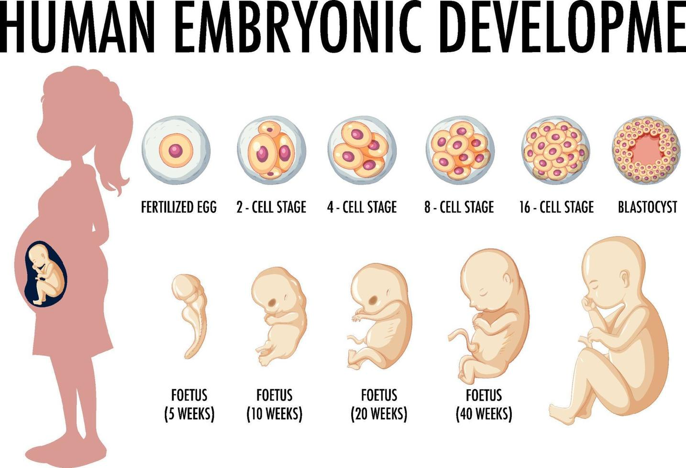

# 一些思考

生命是什麼？
生命的出現與消亡由誰決定？
生命倫理討論的核心為何？生、死、決擇
關於生的議題：代孕、人工生殖 
關於死的議題：墮胎、自殺、安樂死、死刑、戰爭
- 什麼時候開始是個人？：墮胎
- 誰有權決定人的死亡？：其它

# 1. 生命從何開始？

對生命價值的普遍理解：
- 「生命是可貴的，因此不能任意殺人」這個觀念，乃是不證自明的普世道德，
- 是神寫在每個人心裡的普遍啟示的一部分 ([羅 2:14](https://www.bible.com/bible/46/ROM.2.14))。
- 人的生命是尊貴的 (無論從人本、神本角度)。
- 因此隨便殺害人的生命是不行的。

這個問題跟墮胎議題有關，也與人權有關，
- 如果胎兒是個人，他就有人權；任何人都不以隨意殺害他
- 如果胎兒不是人，它就沒有人權…
- 神學上不會有問題 (因為上帝創造人…)
- 科學上就有許多細分

**人有價值，甚至是無上的價值，怎麼看呢?**

(摘自羅)
從==人本==主義的世界觀來看：
- 生命之所以神聖不可侵犯，有其不容剝奪之生命權，是因爲人**本身**具有無上價値，
- 這是因爲人本質上**內具**某些特殊能力 (如理性、良知、佛性等)，是其他任何生物所比不上的。
- 因此，「胎兒、胚胎是不是人？」這問題一天不解決，「胎兒、胚胎是否具有無上價値，不容隨意摧殘？」的問題也無從解決；
- 擁有人的特質，才能擁有無上價値。

從==神本==主義的世界觀來看：
- 以神爲中心的世界觀出發
- 人的無上價値，==不是==基於人**本身內在**的優秀條件或特殊能力；
- 人有無上價値，==乃是==根源於在人以外的宇宙獨一眞神；是神**賦予**我們價値，我們才獲得價値。換言之，
- 從以神爲中心的世界觀來看，人的價値並非天生固有和內具的 (intrinsic, inherent)，而是外加於人的 (extrinsic, alien)。
- 聖經根據：
	- 天父是人的創造主，因爲祂顧念我們，所以給予我們僅次於祂的崇高地位，賜下榮耀尊貴爲冠冕，並委派我們代表祂去管理其他一切被造物 ([詩 8:4-8](https://www.bible.com/bible/46/PSA.8.4-8))。
	- 耶穌基督是我們的救贖主，我們是祂的寶血重價所買贖回來的 ([林前 6:20](https://www.bible.com/bible/46/1CO.6.20); [7:23](https://www.bible.com/bible/46/1CO.7.23))。
	- 聖靈是我們的保惠師 (或慰助者)，我們的身體乃是他的殿 ([林前 6:19](https://www.bible.com/bible/46/1CO.6.19))。
	- 人是按着三位一體的神的形像造的 ([創 1:26-27](https://www.bible.com/bible/46/GEN.1.26-27))，由於人酷像神，所以便分受了祂的無上價値 ([創 9:9](https://www.bible.com/bible/46/GEN.9.9); [雅 3:9-10](https://www.bible.com/bible/46/JAS.3.9-10))。
	- 因此，「人類的價値並非根源於人自己，而是根源於神」這論點便昭然若揭了。

賈 圖10.1

# 2. 什麼時候開始是個人？

(參考：張立明。《人之初：胚胎生命起點的探討》)
## 2.1 人與非人的分界線 (六觀點)

從卵細胞受精後到出生，到底什麼階段可以算做人？
- 如果胚胎、胎兒**不是人**，只是一團肌肉或細胞組織，那麼墮胎只是割去一團肌肉或細胞組織，我們無須大驚小怪，因爲並沒有殺人。
- 如果胎兒、胚胎**也是人**；墮胎，就等於容許孕婦及醫師動輒謀殺無辜人的生命！

再細分，胎兒的發展，有好幾個階段，究竟人的生命始於何時？
- 假如人的生命開始得晚，則懷孕初期的墮胎便非殺人；
- 假如人的生命起始得極早，則幾乎所有的墮胎均與殺人無異。

關於人的生命應從哪一階段算起，仔細的說，至少有六種意見：
- 卵細胞受精後；
- 結合體成功植上子宮壁後（懷孕兩周之後）；
- 胚胎略具人形：臉、手指、腳指、內臟、骨骼等皆具雛 形；有固定的心跳，腦電波也能測到（第八周）；
- 胎動（三至四個月後）；
- 移出母體仍能養活（viability ）（六至七個月後）；
- 嬰孩出生後。

## 2.2 聖經怎麼說？

賈斯勒第八章「墮胎」中提到三種對於人的看法，並提出各觀點之聖經支持
### 2.2.1 胎兒低於人

**經文支持**
- [創世記二章七節](https://www.bible.com/bible/46/GEN.2.7)  記載，人成爲「有生命的活人」，是在神將生命賜給那人之後。由於呼吸是在出生以後才開始，故此，未出生的胎兒在出生以前並不是人類。
- [約伯記卅四章十四至十五節](https://www.bible.com/bible/46/JOB.4.14-15)  記載，若神「把靈和氣收歸自己，有血肉生命的就都一同氣絕身亡」。這裏再一次說明，生命和「呼吸」是息息相關的，因此，沒有呼吸以前，便沒有生命存在。
- [賽 57:16](https://www.bible.com/bible/46/ISA.57.16)  提到「靈 (breath)，就是我所造人」。也似乎指出人受造的起頭，是開始呼吸的時候。
- [傳 6:3-5](https://www.bible.com/bible/46/ECC.6.3-5)  宣吿：「流產的胎」進入世界中乃是 「虛虛而來，暗暗而去……看不見天日，又一無所知」。他們相信這是說未出生胎兒和死人無異，都是無知無覺地躺在黑暗的墳墓裏 ([傳 9:10](https://www.bible.com/bible/46/ECC.9.10))。
- [太 26:24](https://www.bible.com/bible/46/MAT.26.24)  記載耶穌論及猶大的話：「他沒有生下來倒好」。這話暗示生命是從出生之時才開始。否則， 耶穌應該說：「那人沒被懷孕倒好」了。

反對這樣論證的經文：
**==呼吸==並不是人類生命的起始**  
- 呼吸若是等於有生命的話，那麼，停止呼吸便是表示失去人類生命了。
- 但聖經淸楚地說，人停止呼吸後，依然存在 ([腓 1:23](https://www.bible.com/bible/46/PHP.1.23); [林後 5:6-8](https://www.bible.com/bible/46/2CO.5.6-8); [啟 6:9](https://www.bible.com/bible/46/REV.6.9))。
- 聖經指出呼吸還未曾開始以前，生命在母腹的時候已經開始了，即受孕之時。
	- 大衞說：「我母親在罪中懷了我」([詩 51:5](https://www.bible.com/bible/46/PSA.51.5))。
	- 天使說馬利亞「懷的孕是從聖靈來的」([太 1:20](https://www.bible.com/bible/46/MAT.1.20))。
	- 在醫學上，有不少停止了呼吸的人，藉着儀器的幫助，最後得以復甦或生存。
- 値得注意的是，講論「呼吸」的經節，並不是討論人生命的起始，而是人起初「==出場==」的情況。
	- 出生乃是人首次在世界露面的時候。
	- 這些經文談論==可見生命==的起始，而不是==生命==的起始。
	- 在聖經時代，人早已曉得在母腹中的胎兒是有生命的。母親能夠感受到胎兒在腹中移動，甚至跳躍 ([路 1:44](https://www.bible.com/bible/46/LUK.1.44))。出生並非視爲人類生命的起始，而只是生命在可見的自然世界中的起始或出現——是人類初次出現。

**亞當是獨特的例子**  
- 亞當是直接由神所創造，他是一個獨特的例子。
- 因此，直至他開始有了呼吸的時候，他才成爲「一個人」是不能成爲證明個人生命何時開始的決定性證據。 
- 首先，亞當不像其他人經過受孕、出 生等步驟，而是直接受造的。
- 其次，亞當開始了呼吸後才是人類的事實，是不能證明今日個別生命的開始都必然如此；同樣，亞當受造時已經是成人，並不表示我們成年了，個別生命才開始。
- 第三，創世記二章七節的「氣」，是指生命（看 [伯 33:4](https://www.bible.com/bible/46/JOB.33.4))。因此，這節經文的意思，不是說亞當的生命是從呼吸開始，而是說神把生命給了亞當，生命才開始。而亞當子孫的生命卻是從受精或受孕而來的 ([創 4:1](https://www.bible.com/bible/46/GEN.4.1))。
- 第四，其他會呼吸的動物，並非必然是人類 ([創 7:21-22](https://www.bible.com/bible/46/GEN.7.21-22))。

### 2.2.2 胎兒是一個完全的人

**經文支持**
- 未出生的胎兒也被稱爲「孩童」，同樣的字眼也用作形容嬰兒和幼童 ([路 1:41](https://www.bible.com/bible/46/LUK.1.41), [44](https://www.bible.com/bible/46/LUK.1.44); [2:12](https://www.bible.com/bible/46/LUK.2.12), [16](https://www.bible.com/bible/46/LUK.2.16); [出 21:22](https://www.bible.com/bible/46/EXO.21.22))；有時甚至形容成人 ([王上 3:17](https://www.bible.com/bible/46/1KI.3.17))。
- 胎兒是由神所創造的 ([詩 139:13](https://www.bible.com/bible/46/PSA.139.13))，正如亞當和夏娃乃是照神的形象而造 ([創 1:27](https://www.bible.com/bible/46/GEN.1.27))。
- 未出生胎兒的生命若受到傷害或死亡 ([出 21:22](https://www.bible.com/bible/46/EXO.21.22))，他們與成人一樣，有着同奪刑罰的保障 ([創 9:6](https://www.bible.com/bible/46/GEN.9.6))。
- 基督在馬利亞腹中受孕時 ([太 1:20-21](https://www.bible.com/bible/46/MAT.1.20-21); [路 1:26-27](https://www.bible.com/bible/46/LUK.1.26-27))，已經是人了 (神人一體)。
- 神的形象包括「男和女」([創 1:27](https://www.bible.com/bible/46/GEN.1.27))，但分爲男性或女性的性別，在受孕時已被決定了，這是科學上的事實。
- 未出生的胎兒具備個人的特性，例如罪 ([詩 51:5](https://www.bible.com/bible/46/PSA.51.5)) 和喜樂 ([路 1:44](https://www.bible.com/bible/46/LUK.1.44))，這是人類的特質。
- 用人稱代名詞來稱呼未出生的兒童（[耶 1:5](https://www.bible.com/bible/46/JER.1.5)《七十士譯本》；[太 1:20-21](https://www.bible.com/bible/46/MAT.1.20-21))，正如稱呼其他人類一樣。
- 未出生的胎兒被描寫爲親密而個人地被神所認識，正如祂認識其他人一樣 ([詩 139:15-16](https://www.bible.com/bible/46/PSA.139.15-16); [耶 1:5](https://www.bible.com/bible/46/JER.1.5))。
- 未出生的胎兒在出生之前，也蒙神所呼召 ([創 25:22-23](https://www.bible.com/bible/46/GEN.25.22-23); [士 13:2-7](https://www.bible.com/bible/46/JDG.13.2-7); [賽 49:1](https://www.bible.com/bible/46/ISA.49.1), [5](https://www.bible.com/bible/46/ISA.49.5); [加 1:15](https://www.bible.com/bible/46/GAL.1.15))。

綜合來看，這些經文
- 把未出生的胎兒與兒童和成人視爲同等，同樣是一個具有神的形象，而有位格的人。
- 他們在受孕那一刻開始已照神的形象被造。
- 在妊娠時期，他們的生命在神眼中看爲寶貴，是受到祂禁止殺人的誡命所保護。

### 2.2.3 胎兒是潛在的人

**經文支持**
有幾處經文是用來支持未出生胎兒只是潛在的人。其中最常引用的，乃是出埃及記廿一章。
- [出 21:22-23](https://www.bible.com/bible/46/EXO.21.22-23)  這段經文記載如下：
	- 引致胎兒死亡只需賠償金錢，但引致孕婦死亡，便要償命。
	- 母親的生命，便比胎兒的潛在生命更有價値了。
	- 殺掉胎兒只需罰款而不用死刑，就證明胎兒並不被視作完全的人了。
- [詩 51:5](https://www.bible.com/bible/46/PSA.51.5)  大衞說：「我是在罪孽裏生的，我母親在罪中懷了我」。
	- 在受孕之時，大衞是一個罪人是甚麼意思呢？
	- 他顯然不是眞正的罪人，因爲他還未曾犯罪。
	- 所以這個理論便解釋爲，==大衞是一個潛在的罪人==。
	- 當他眞正成爲人的時候，他才變成眞正的罪人。
- [詩 139:14-16](https://www.bible.com/bible/46/PSA.139.14-16)  詩人這樣描述我們在母腹成形的過程：
	- 我的臟腑是你所造的，在我母腹中你塑造了我。
	- 在地的深處被塑造，我未成形的身體，你的眼睛早已看見。
- 從以上的經文來看，這理論的支持者辯稱，
	- 胎兒不是完全的人，因爲他仍在「塑造」的過程中，仍「未成形」。
	- 他們又引證傳道書的經文 ([傳 6:3-5](https://www.bible.com/bible/46/ECC.6.3-5))，描述胎兒沒有「氣息」或「一無所知」。
	- 故此，腹中的胎兒是一個發展潛能，會逐漸成爲人。

- [羅 5:12](https://www.bible.com/bible/46/ROM.5.12)  聖經說：「罪藉着一個人［亞當］入了世界，死又是從罪來的，所以，死就臨到全人類，因爲人人［在亞當裏］都犯了罪」。
	- 然而，所有人顯然不是眞正地「在亞當裏」。
	- 所以支持這理論的人辯說，全人類只是「潛在」亞當裏面。
	- 結論：我們出生前只是潛在的人，後來才成爲眞正的人。
- [來 7:9-10](https://www.bible.com/bible/46/HEB.7.9-10)  說：「……利未，也透過亞伯 拉罕繳納了十分之一。因爲……利未還在他祖先的身體裏 面」。
	- 由於利未在亞伯拉罕以後百多年才出生，顯然他不可能眞實在亞伯拉罕身體裏面。
	- 他一定是潛在那裏。
	- 因此，透過對比的辯證，在母體中未出生的胎兒，只是==潛在==的人而已。

**反對經文的解釋**
- [詩 51:5](https://www.bible.com/bible/46/PSA.51.5)  並不支持那些主張胎兒是潛在的人的看法。
	- 即使這段經文敎導受孕時的胎兒是潛在的罪人，也不能因此推論他們只是潛在的人。
	- 事實上，從受孕開始，人被稱爲罪人，證明了他們是人，意即是墮落人類的一份子。
	- 我們在罪中被懷孕，完全是因爲我們是屬乎亞當人種的緣故 (看 [羅 5:12](https://www.bible.com/bible/46/ROM.5.12) 的討論)。
- [詩 139](https://www.bible.com/bible/46/PSA.139)  強烈支持未出生的胎兒是完全的人，而非潛在的人之觀點。
	- 「未成形」(16節) 並非和「畸形」一樣，表示不是人的意思。
	- 腹中的嬰兒是被「造」(bara) 的，創世記1:27也用這個字描述人按「神的形象」被造。
	- 耶利米書1:5 用了「人稱代名詞」來稱呼還未出生的胎兒，又說神「認識」在腹中未出生的胎兒，這個名稱已表示個人的關係已經存在了。
	- 每個腹中未出生的胎兒，都已被記錄在天上神的册子裏。
- [羅 5:12](https://www.bible.com/bible/46/ROM.5.12)  暗示每個人都在亞當裏，但並非是 說，他們在未出生以前都是潛在的人。
	- 這段經文不是討論子宮中的胚胎，而是討論全人類都在亞當裏的事實。
	- 事實上，我們全都遺傳性地或代表性地存在於亞當裏面。
	- 因此，在他的罪中有份，顯示了人類的全體性。
	- 旣然在人的裏面有着這種統一性，無論我們居住在那裏，仍是與其他人完全不可分割的 ([羅 14:7](https://www.bible.com/bible/46/ROM.14.7))。
	- 事實上，人從受孕之時，已在亞當裏被稱爲罪人 ([詩 51:5](https://www.bible.com/bible/46/PSA.51.5))，
	- 同樣地，在受孕之時，那人已經是人類的一份子了。
- [來 7:9](https://www.bible.com/bible/46/HEB.7.9)  不是論及胚胎，更不是論及胚胎是潛在的人。這段經文不是說利未潛在於亞伯拉罕裏面。
	- 他可能只是代表性或象徵性地存在於亞伯拉罕身內。
	- 然而，即使利未眞是「潛在」亞伯拉罕裏面，但不能推論利未是在亞伯拉罕身內的胚胎。
	- 若果利未被稱「在亞伯拉罕身內」之時還未受孕，他已經是一個潛在的人，那麼，我們還未曾受孕之前，也是潛在的人了。
	- 若是這樣，人類的精子 (還未曾使卵子受精之前) 也是潛在的人了。
	- 但這在遺傳學上是錯誤的。精子有23個染色體， 而胚胎卻有46個。
	- 胚胎有人的靈魂，但是精子卻沒有。

### 2.2.4 小結：生命始於受精之時

賈氏：聖經和科學都是支持個人生命始於受孕的觀點。

莊氏：
>[!Bible] [出 21:22-23 CUNP-神]
>「人若彼此爭鬥，傷害有孕的婦人，甚至墜胎，隨後卻無別害，那傷害她的，總要按婦人的丈夫所要的，照審判官所斷的，受罰。 若有別害，就要以命償命，

- 但是此處和合本譯為「墜胎」的字應譯為「早產」（如NIV, NASB, NIT及和合本修訂版）， 所以才可能有較輕的處分。
- 因為如果有「別害」就是造成流產或嬰孩因此殘障，就要以過失殺人或「以傷還傷」來處理。
- 換句話說，嬰兒與成人具有一樣的身份與價值。

孔氏：
- 同莊氏引用出21:22-23說，用早產解釋
- 未出生的嬰孩是人，而神照顧在胚胎狀態中的人 ([詩 139:16](https://www.bible.com/bible/46/PSA.139.16))。  
- 正在母體孕育的嬰兒被稱為「孩子」([路 1:41](https://www.bible.com/bible/46/LUK.1.41), [44](https://www.bible.com/bible/46/LUK.1.44))。
- 神揀選了尚未出生的人。當耶利米和保羅仍然在娘胎裏時，神就預備了他們一生的工作而呼召他們 ([耶 1:4-6](https://www.bible.com/bible/46/JER.1.4-6); [加 1:15](https://www.bible.com/bible/46/GAL.1.15))。

羅氏：
- 不認為受精後就是一個人，而是潛在的人。
- 可以從羅氏來學習一個細緻的分別。

## 2.3 羅秉祥的分析與見解

### 2.3.1 受精後就是人？

這是最保守的見解。

基于微生物學最近的發展，
- 誠實的科學家必定確認生命的開始是成孕的那一刻，這正是大部分生物學教科書所確認的。
- 這一刻就是當一個受精的卵子 (zygote) 形成時，因為它已經是一個完整而獨特的生命，它在整個懷孕期間再不需要加進任何基因物質。
- 成孕的那一刻：獨特地與父母的基因 (genes) 相似
- 成孕后四星期：體內器官已形成、心臟開始跳動 (已有官能的獨特性)成孕后 6 星期:身體和四肢活動(已有行為的獨特性)
- 成孕后八星期：腦電波對刺激有反應 (可以感覺痛苦)，所有器官已存在，最初的胚胎已分成十億個細胞 (已有精神的獨特性和社交的個體性)。
- 成孕八星期后：嬰孩已完全是一個完整的個體。
- 大多數墮胎在成孕后 9 至 12 星期之間施行。早產嬰兒若在 22 至 24 星期誕生可單獨生存，但是墮胎甚至在這時間后仍被允許。  
- [Zinc Fireworks](https://youtu.be/b9tmOyrIlYM)
	- 當**人類卵子被精子受精的瞬間**，科學家觀察到會釋放出大量鋅離子（Zn²⁺），並產生**可見的微小閃光（fluorescence）**。這一現象被稱為「**Zinc Spark（鋅火花）**」。
	- 這個現象首先在小鼠卵子中發現，後來在**人類卵子中也被證實**（2016年美國西北大學的研究，Nature Chemistry 發表）。
	- 用螢光標記追蹤鋅離子，當受精發生時，鋅離子被釋放、螢光劑反應，畫面出現閃光，
	- 影片以顯微鏡與增強處理呈現出「一閃而亮」的畫面。

論點：
- 一個人的演變與成長要經過以下的階段：受精卵、結合體、胚胎、胎兒、嬰孩、小孩、少年、靑年、成年……。
- 階段與階段間儘管生理上有別，但在道德考慮上卻不相干。
- 成年人是人，絕無人有異議；靑年雖稍有別於成年人，但二者相似之處甚多，故靑年亦是人。
- 少年雖稍有別於靑年，但二者相似之處亦甚多，故少年也是人……。
- 初生嬰孩是人，即將出生的胎兒也是人。
- 孕期第九個月將出生的胎兒是人，那麼孕期第八個月的胎兒也是人……。
- 依此類推…
- 則旣然從受精卵到嬰孩，以至成年人的發展是延綿不斷，循序漸進的，而各階段儘管生理上有別，但這些差別於道德上是不相干的 
- (沒有甚麼理由使我們能說取去某一個階段的無辜生命是殺人，而取去其緊密相接的前一階段的無辜生命卻不是殺人)；
- 因此我們只能結論說，人類生命始於受精卵了。
- 換言之，不只成年人是人，靑年是人，少年是人....嬰孩是人，胎兒是人，胚胎也是人，受精卵也是人。

批評：
- 其一是：如此類推，豈非連精子、卵子也是人嗎？
	- 爲何這推理只停在受精卵的階段而不再往前追溯？
	- 假如這追溯停在受精的階段是隨意選定的話，爲何我們又不可早一點停下來，只追溯到胎動與胎兒能移出母體而養活的階段？
	- 關於此點，保守派人士是可以有具說服力的回覆，我們留待下一節中再討論。
- 其二 (這個頗爲致命)
	- 這種推理是一種「滑斜坡論證」(slippery slope argument)；
	- 只要你踏上第一步，你便會直滑到底而不能停。
	- 同樣，只要我們承認成年人是人，並且承認人成長中每一接續階段間的生理差別，皆是在道德考慮中毫不相干，則我們便會直滑下去，非要承認受精卵也是人不可。

羅氏評論：
- 的確，自受精卵至成年人，各接續階段間並沒有道德上相干的差別，使我們有正當理由說某一階段是人，而與其緊密相接的前一階段卻不是人；
- 但是，我們也得承認，一個成年人、靑年、少年等，與一個受精卵，無論外在形狀、內在構造，都有極顯著的差異。
- 假如一個生命的發展要經歷一百個階段 (Tl, T2, T3, ... T99, T100)，
	- 即便 T1 和 T2 之間沒有顯著差別，T50 和 T51 之間沒有顯著差別，T99和 T100 之間也沒有顯著差別)
	- 這絕不表示 T1 和 T100 之間也沒有顯著差別！
- 雖然一個成人是從受精卵逐步發展而來，但若我們要堅持受精卵就是人的話，也就是相當於堅持
	- 蓮子就是蓮花，毛蟲就是蝴蝶，
	- 吃茶葉蛋就是吃茶葉雞，芙蓉炒蛋就是芙蓉炒雞 (假設這些蛋已受精)!
	- 「滑斜坡論證」的謬誤，是顯而易見的。

#cmt 
- 所以，羅氏認為：受精卵不是人。

### 2.3.2 胎兒不是人？

**人的生命起始於嬰孩出生後。**
- 選擇嬰孩出生作爲人生命的起點，表面上看來也很自然。
- 再者，儘管自受精卵發展，至成年人的各接續階段間，大致上並沒有甚麼巨大的差異，但嬰孩誕生時，卻有極明顯的轉變：
- 誕生前，住在母胎中，各種養料全倚賴母體供給；
- 誕生後，從此脫離母胎，至少在身體方面獨立於母體之外。
- 因此，未出生的胎兒皆不是人，墮胎並無道德上不妥之處。

羅氏批評
- ==嬰孩誕生前後的區別，主要屬於位置和生理活動方面==。
- 出生前，胎兒處於母腹之中；出生後，「遷居」到塵世間；
- 但這位置上的不同在道德上卻是不相干的，人不應該因爲遷居而在生命權上有所增減。
- 其次，出生後，嬰孩開始自己呼吸、吮乳；將出生的胎兒，雖然沒有這些行動，卻已具備這些行動的能力，只要一離母體，來到世間，便能馬上行使這些能力。
- 是故，只要具備了獨立自己呼吸、吮乳的能力，不論已開始行使這些能力與否，在道德上都是不相干的。
- 不能因他的位置是在母腹（儘管一星期後他就會離開母腹），且尙未開始運用呼吸、吮食等器官（儘管一星期後他就會開始運用），我們便說他不是人，可隨便取去他的生命。
- 假如嬰孩的生命是値得我們尊重的話，則不管他位於母腹之內或外，也不管他獨立維生機能已開始運作與否，其生命都應受到同樣的保障。
- 例子：若只因位置和生理活動上的差別，便決定胎兒是不是人…
	- 一個於孕期第二十五星期便從母腹中取出，放在保溫箱的胎兒是人，我們不可取去其生命；
	- 而一個留在母腹中三十九星期尙未出生的胎兒，儘管孕期更久，生理上要更成熟，且不見得比前者更不能自立， 但卻因位置和生理活動上的差別，因此被判定爲非人，生命可容剝奪！
	- 同一醫院中
		- 一些小兒科醫師用盡一切辦法，去維持一些早產不成 熟胎兒的生命；
		- 一些婦產科醫師卻要盡力去毀滅一些比前者更成熟的胎兒生命！
		- 同是胎兒，一個提早溜到世上來，雖是身體極度虛弱，也被當作是人；
		- 而另一個卻乖乖臥在子宮中，等待瓜熟帯落，他雖然在生理上比前者更成熟， 卻被視爲非人！
		- 可見，以==出生作爲人與非人的分界線，對於某 些胎兒來說，是非常不公平的==。

**人的生命起始於胎兒具有移出母體後仍能養活的能力**；
- 只要胎兒移出母體後，能夠養活 (viable) 即是人，所以==孕期不足六個月的胎兒皆不是人==。
- 此論點所忽略的，是胎兒在甚麼階段移出母體，可以存活，完全看**醫學**技術的進展如何。
	- 目前的醫學技術可以使孕期約六個月以上的正常胎兒，靠着人工輔助 (incubator，保溫箱) 活於母體之外，但我們焉知未來醫技的發展不會使胎兒更早即可在母體之外存活？
	- 理論上，我們甚至不能否定將來醫技會發展到一個程度，以致胎兒自受精卵的階段起，便能活於母體之外！
- 於此可見，胎兒有沒有能力在母體外存活，並不是決定人 類生命起點可靠標準。
- 如果這是標準，六個月大的胎兒，今天算是一個人，但一千年前卻不算；
- 同理，三個月大胎兒，現在還不能算是人，
- 但五百年後卻可能被認爲是一個人！

### 2.3.3 潛在的人

羅氏的思考：
- 一個受精卵並不能算是一個不折不扣的人，
- 一個孕期達三十九星期而尙未出生的胎兒卻絕不能當作是「非人」。
- 究竟從受精卵發展至胎兒出生這過程中，在哪一刹那一個不折不扣的人的生命才開始呢？
- 這過程是循序漸進，緊密相接的，我們很難找到一明顯的分割點來指出人的生命就是從那一剎那開始，在那一刻以前該生命絕不是人的生命。

羅氏認為，可以確定的是：
- 人的生命肇源於受精卵：嬰孩是從胎兒發展而來，而胎兒又是相繼從胚胎、結合體和受精卵發展而來的，是故一個人的生命必須溯源至受精卵。 
- 爲甚麼不溯源至精子及卵細胞呢？
	- 只有在卵細胞受精成爲一個新細胞後，一個獨特的人的生命時空因果連鎖發展才開始；
	- 只有精子，或只有卵細胞，一個獨特的人的生命的時空因果連鎖發展是無從開始的。
	- 當一個卵細胞受精成爲一個新的細胞後，這個新細胞便有一個獨特的遺傳基因結構或密碼 (在這細胞核內有 四十六條染色體，分別從父母雙方承繼各一半)。
	- 這密碼決定了這個生命將來的許多特徵，如性別、身高、頭髮、眼睛及皮 膚的顏色、個性、智力等。
	- 因此，只有在受精卵中才具有人類生命的充分潛能，精子本身或卵細胞本身皆不具備。
- 受精卵 vs. 精子或卵細胞
	- 一個受精卵及一個精子或卵細胞本身的確都是有所倚靠才能發展成一個人。
	- 重要差別於
		- 受精卵：本身已有充分的內在條件，只缺外在有利環境，正是「萬事倶備，只欠東風」，
		- 精子或卵細胞：不但有賴於有利的外在環境，連基本的內在條件也付厥如，不但欠東風，且非萬事皆備！

羅氏類比：
- 對外在環境有所倚靠並不影響一個有機體的地位，
- 只有當其內在條件也缺乏，其「本質」也因而受影響時，其地位才改變。
	- 一個正常的人也要倚靠食物、水分、空氣等才能維持生命，
	- 而某些重病或重傷的人也需氧氣筒來幫助其呼吸，
	- 但這並不表示他們已喪失了一個人的地位；
- 受精卵雖然也要倚靠母體的正常養料供應及一個健康的母體來維持其生命及使其成長，
	- 但這並不表示受精卵不具備成爲一個人的充分潛能。
	- 反觀一個精子或卵細胞本身，不但須仰賴有利的外在條件，且須要有「另一半」才能開始一個「新生命」的發展。

羅氏結論：
- 儘管一個受精卵、結合體、胚胎，甚至胎兒等皆不是一個實實在在的人，
- 但它們皆具有成爲你和我一樣的人的潛能，人的生命乃肇源於此。
- 因此，它們是==潛在的人==。
- 它們的道德地位雖然與實在的人的道德地位不同，但卻遠遠高於鷄、犬、人的內臟、器官及細胞組織的道德地位。
- 換言之，一個==潛在的人所應享有的道德地位是相當接近一個實在的人的道德地位==。
- 因此之故，取去一個無辜受精卵、結合體、胚胎，與及胎兒的生命，是取去一個無辜潛在的人之生命。
- 一般社會的倫理道德皆禁止我們隨意取去無辜人的生命，舊約聖經也如此明文指定：「不可殺無辜和有義的人」([出 23:7](https://www.bible.com/bible/46/EXO.23.7))，
- 所以我們也不可隨意奪去無辜潛在的人之生命；
- 換言之，在孕期哪一階段隨意墮胎都是不對的。

## 2.4 結論

什麼時候開始是個人？
- 嬰兒出生之後，無疑是個完全的人；問題在於尚未出生之前。
- 大部份基督學者都同意從受精開始，就是個完全的人。
- 但羅氏有不同見解，
	- 他認為直接認定受精卵是個人有困難，(以雞/雞蛋為例)
	- 但又無法在**受精卵**與**初生嬰兒**之間切出一線
	- 因此他說這中間是「潛在的人」。

# 3. 墮胎，可以/不可以?  

## 3.1 原則上是不可以墮胎的

墮胎的目的有很多，但大多都是，不合理、不道德、自私的、邪惡的 (孔氏)。
以下是從基督教角度來說，大家比較有共識，是**不可以墮胎**的情況：

**個人偏愛：如性別選擇。**
- 很多人重男輕女，懷孕時以超聲波檢驗，若發覺胚胎為女孩，便實行墮胎。這在印度被廣泛地使用。  

**母親心理低潮**，
- 這是墮胎最普遍的理由，但在絕大部分情形下只是一個藉口，目的是剷除不想要的懷孕，所以用這個原因墮胎是不合理的。  

**胎兒是先天性畸型兒或者不是他們想要的男嬰**
- 即使是先天性的畸形兒，仍然有人的尊嚴與生存權。
	- 否則依據道德滑坡理論，以後就會有人提議：我們是否也有權力將所有已出生的畸形兒、老年癡呆症者和植物人的生命奪去？
- 其實有人估計，在美國，每年照顧 5000 位唐氏症的孩童所花費的經費，只有花在購買狗食物的十分之一！
- 很多國家禁止產婦作性別檢測，原因是，在一些重男輕女的國家，會造成女嬰被墮胎的可能性大增，並導致嬰兒男女出生比例失衡。中國是全世界男女比例失衡最嚴重的國家 (高達 118:100)，就是因為一胎化政策與強制墮胎所造成的。這個失衡問題在未來數十年內 可能都無法補救。
- 同樣，讓人領養是一個可行的解決方案。在西方國家有很多基督徒出於愛心願意收養畸形兒，這是一個值得讚賞的美德。 #cmt 如果先知道了，不能墮胎，但又不能馬上有愛心人士接手，如何處理?
- (孔)
- 聖經形容先天缺陷的個案也有神的主權 ([出 4:11](https://www.bible.com/bible/46/EXO.4.11); [約 9:3](https://www.bible.com/bible/46/JHN.9.3))。
- 如果人決定以「生命的質量」為理由而殺人,  則他就取代了神。
- 重視「生命的質量」過于「生命的神聖」總是錯誤的，判斷另一個人生命質量的高低，是隨己意的，且經常是錯誤的。
- 例如大部分殘障的人都因有生命而高興。因此，因嬰兒有缺陷或殘障而墮胎是不合理的。(只在罕見的情况下可允許墮胎，例如沒有腦袋的嬰兒，或嬰兒誕生后必定在短期死亡。) 

**人口過度膨脹**
- 控制人口最有效而且人道的方法，乃是以教育的手段，來倡導節育、 避孕或計劃性生育。
- 事實上，當社會逐漸邁向富裕時，生育率自然會降低。
- 生育率非常高的穆斯林國家，在過去三十年來生育率已經降低至原有的一半甚至三分之一，接近先進國家的較低生育率了。

**家庭狀況不適合（如婚外生子、經濟能力欠佳、時機不對等）**
- 採取事先的預防措施 (如避孕或計劃生育) 才是根本之計，而不是以墮胎方式處理。
- 因為經過墮胎手術後，有可能導致婦女將來不孕，原因包括子宮頸閉鎖不全、子宮內膜受損等。
- 如果情況實在不得已，還可以選擇在生==產後讓人領養==的方式，而不必墮胎。
- 對基督徒來說，如果意外懷孕，擔心經濟能力不夠，或者時機不合 適，可以藉信心仰望神，祂必供應。
- 不要去做違反神誡命的事，以至於錯上加錯。

## 3.2 可以墮胎的情況 (有共識的)

母親生命的危險:
- 這是允許墮胎的唯一理由，
- 母親的死亡極可能導致嬰孩隨后死亡，例如胚胎種植于輸卵管內。
- 母親的死亡會使其他人承擔更大的心理上和情感上的損失。因已存在的情感和社交關係的影響。

但現代醫學技術進步(例如剖腹生產)，因懷孕而危害母親的生命是稀有的。在美國，估計只有
- 0.04% 的墮胎是因強姦或亂倫而施行的；
- 0.1%  是因胎兒殘疾而施行的；
- 少于 1% 是為母親的身體健康而施行的；
- 99% 都是以母親的「精神健康」為理由施行的，
	- 這理由實際上相等于「需求性的墮胎」，也就是無限制墮胎。
	- 連支持墮胎者都承認:  絕大部分墮胎的理由是基于==經濟==上或==工作==上的考慮。 

## 3.3 因強姦/亂倫的懷孕 (有不同看法)

孔氏/賈氏/莊氏：
- 原則是不應墮胎的，
- 除非醫生認為懷孕必定會帶來嚴重的或長期的心理后遺症，則或可考慮墮胎。
- 因為強姦或亂倫而造成受孕的佔極少數 (不到0.1%)，而且目前醫學上有避孕藥和其他方法可以在==24小時==內防止受孕。
- 雖然近親生子是有較高的先天性疾病「可能性」，但並非「必然性」。
- 即使母親不願意養育這個嬰兒，仍可以讓別人領養，而不需要墮胎。
- #cmt 這個有沒有其它問題?

羅氏：
- 認為這個問題需要同時考慮「女權」與「胎權」
- 女人有女人的權利，胎兒也有胎兒的權利，但這兩者的權利都不是絕對的。
- 孕婦的權利不是永遠高於胎兒的權利，
- 胎兒的權利不是永遠高於孕婦的權利。
- 至少在以下兩種情形中，筆者認爲婦權是可以壓過胎權的：
	- ①當繼續懷孕會導致孕婦死亡，
	- ②女子因姦成孕。
	- 在這兩種情形中，墮胎都是可以諒解，可以容許的。

羅氏認爲因姦成孕而進行的墮胎==還是可被容許==的，但我們==必須以新的角度==來看這問題。

### 3.3.1 因姦成孕有不同性質

**不在女子的控制內**
- 因姦成孕不在該女子的控制之內，是她所不需負責任的。
- 受害女子==沒有任何責任==要供應生命養料給那腹中肉。
- 儘管她是用盡所有力量去反對，它還是來了，所以她有充分的權利拒絕供應生命養料給它，不讓這小生命寄生在她腹中。
- 羅氏引用 Thompson 的概念來說明。
  Thomson, Judith Jarvis. “A Defense of Abortion.” _Philosophy & Public Affairs_ 1, no. 1 (1971): 47–66.

**A Defense of Abortion**
假想情境：

有一天早上醒來時，張三發覺他竟躺在一個很有名的小提琴手的身旁。原來這小提琴手腎臟有毛病，必須於短時間內找到一特別健康的腎臟來協助其功能，否則便會有生命危 險。於是那地方的愛樂社社員找遍全國的資料，發現只有張三的腎才可以幫得上忙，便在前一天晚上把正在熟睡中的張三綁架去了那小提琴手住的醫院中，把那小提琴手的腎臟循環系統連接進張三的循環系統中，使張三的腎臓也可過濾那小提琴手體中之病毒。當張三醒來後，那主診醫師便對他說：「眞抱歉，愛樂社的社員竟如此待你！假如我預先知道的話，我一定不讓他們這樣作。畢竟不該作現在也作啦，我也沒辦法；那小提琴手的循環系統已連接到你的體中去，假如你要把它拔掉的 話，他便會馬上一命嗚呼。所以我想你委屈一下吧，反正只要九個多月就好了；九個多月後他便會復原，那時再把它拔出來也不會傷害到他的生命。」

在這種情形下，
- 張三有沒有**義務**要留在那小提琴手身旁九個多月呢？
- 那小提琴手又有沒有**權利**要求張三非要這樣作不可呢？
- 當然，張三如果這樣作的話是最好不過，是一件極美善的事，問題是他有沒有這個**義務**呢？

羅氏認為：

**沒有誰的生命權高過誰！**
- 儘管那小提琴手和一般人一樣有生命權，但這並不表示他因此便有權爲了他自己生命的緣故，要求他人非要爲他作巨大及無辜的犧牲不可。
- 當然，別人若肯這樣作是最好不過，但他有**權利**要求別人非要這樣作不可嗎？
- 別人若不如此作，他有**權利**去責備別人侵犯了他的生命權嗎？當然沒有！
- 正如一個與你毫無關係的人，也沒有權利因爲要保存他自己生命的緣故，而要求你一定要傾家蕩產，妻離子散，身心受煎熬地爲他無辜憊牲！
- 你對他也沒有這個責任。你若願意這樣爲他儀牲是很好，
- 但這不是一個人皆當履行的責任；這樣的無辜犧牲是一種==超義務的英勇行動== (supererogatory, heroic act)。

**但有人先侵犯另一人的權益！**
- 那小提琴手是首先侵犯了張三的權益，不理會他的態度，而把其循環系統連接張三體中。
- 所以，張三本身是絕對有權維護自己的權益，拒絕繼續作無辜的巨大犧牲，而把它拔掉。

**是謀殺還是捍衛自紙權益？**
- 是的，假如張三要把那小提琴手的循環系統從他自己身體中拔出，一個無辜人的生命便會結束；
- 但==嚴格來說，這尙不能算是謀殺==。
- 因爲想深一層，在一般意義下的謀殺中，一個兇手是蓄意和主動地去强奪另一個獨立自存的無辜生命。
- 但首先，張三==不是蓄意要去殺==那小提琴手剝奪他的生命權，他只==是拒絕作超責任的無辜犧牲==，
	- 拒絕爲那小提琴手提供腎臟過濾服務，保護自己的權益而已。
- 再者，那小提琴手的生命已並非一獨立自存於張三之外的生命；
	- 在違背張三的意願的情形下，別人强把他的生命維繫在張三身上，侵犯張三的權益，迫使張三要爲他提供腎臟過濾服務，張三被迫要付出重大代價來使他免於死亡；
- 假如不是先有侵犯張三權利的暴行，那小提琴手老早便與世長辭了。
- 所以，在這特殊情形下，張三把那小提琴手之循環系統從他體內拔出，雖然會引致那小提琴手死亡，但卻與一般謀殺不同，不能混爲一談。

### 3.3.2 誰的生命權更重要？

因姦成孕的倫理思考
- 那女子腹中之生命之出現，完全是因爲在違背該女子的意願下有精子强闖進來；
- ==因此那受精卵、結合體、胚胎或胎兒本身儘管是有生命權，但卻沒有權利要求一定要繼續留在那女子腹中，要求該女子非要爲它提供生命養料不可==。
- 同樣地，那女子也沒有義務要作出巨大而無辜的犧牲，讓它寄生在她腹中，吸取她身上的生命養料。
- 當然，她若願意這樣作是最好不過，是一件極美善的事，但==這不是一個道德義務，而是一超義務的英勇行爲==。
- 倘若她不願意，儘管那潛在的人之生命是會結束，這仍不是謀殺， 因爲那生命是强闖進來依附在她身上；
- 她的墮胎，只是拒絕讓這强附在她身上的生命不合理地繼續寄居下去，拒絕爲這不請自來的生命提供生命養料，而不是蓄意要去强奪一個本是獨立自存的無辜生命。
- (因此之故，倘若於墮胎手術後那胎兒尙能存活於母體之外，則無論那醫師或那女子皆沒有權利進一步地蓄意把它的生命奪去，這樣做便是赤裸裸的謀殺！）

羅氏強調
- 因姦成孕：
	- 新生命是精子强闖進來的結果，是女子所完全沒法控制的，
	- 因此這個成孕也是那女人所不需負任何責任的。
	- 所以：那新生命才沒有權留在她腹中，而那女人也沒有義務要讓它逗留下去，也沒有義務爲它提供生命養料；
	- 這樣的墮胎，是把非法入境者及非法取用寶貴資源者驅逐出境，這是可接受的。
- 其他情形下的懷孕，
	- 不管是多「意外」，當事人都難以推卸責任。
	- 儘管他們是不準備要有孩子，但他們都充分知道性交是會有引致懐孕之可能性 (沒有任何避孕方法是百分之百可靠)。 
	- 因此當女方懷孕後，男女雙方都不應逃避責任，把他們一手帶來的新生命扼殺掉。

羅氏重申：
- 儘管那受害女子==沒有道德義務==要讓那新生命留在腹中，但她如肯作無辜犧牲，把那孩子生下來並撫養成人，則實在是極美善的事，是一 件超義務的英勇行爲。
- 但假若我們要勸某些受害女子去作這犧牲的話，也要看情形而定。
	- 對於一個 30 歲於生理和心理皆已成熟的女子，我們也許可勸她作此犧牲；
	- 但對於一個 14 歲無論在生理和心理方面都皆未成熟，且於一個晚上被輪姦數次，以致驚魂落魄，心膽倶裂的小女孩，我們又怎能要求她作這犧牲呢？
	- 對於一個身、心、靈飽受蹂蹒的無辜少女，我們又何苦强迫她還要懷孕、生產及養育那個她所不需負責任的小孩，以致加深她的痛楚和令她的人生受更大折磨？
	- 在這種情形下，我們容許她墮胎也許才是一較道德的行動！
	- 在這個墮落的世界中是有不少悲劇，這些悲劇旣發生了，我們便要運用神所賜給我們的智慧，盡量阻止這些悲劇再擴張，而不應惰於思辨，一成不變。
- 因姦成孕而墮胎在道德上是可容許的，但始終我們不能忽略一件事：
	- 一個無辜潛在的人之生命是會因此而被奪去，==這仍是一悲劇，一沈痛的事實==。 
	- 但引致這悲劇的不是那受害女子，也不是那手術醫師，而是那沒天性的强姦犯，是那禽獸不如的暴徒！
	- 罪惡往往不只是一件孤立的事件，而是有一連串的連鎖惡果的！
	- 反對墮胎的人，不應找那受强姦的女子理論，而應找那强姦犯算賬！

